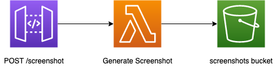

# serverless-lambda-layers

## Introduction

An example online screenshot application using AWS Lambda Layers on the [Serverless Framework](https://www.serverless.com/) which is the base for the following [blog post](https://leejamesgilmore.medium.com/serverless-lambda-layers-d8f8374404e3)

The application uses [chrome-aws-lambda](https://github.com/alixaxel/chrome-aws-lambda) as a [lambda layer](https://docs.aws.amazon.com/lambda/latest/dg/configuration-layers.html) when deployed to the cloud which allows us to use Chromium and [Puppeteer](https://developers.google.com/web/tools/puppeteer) to open the desired webpage within a lambda in a headless browser, generate the screenshot, and store it in [S3](https://aws.amazon.com/s3/) (**returning the download path in the API response**)

## Installation

In the root folder install the dependencies using the command `npm i` (_Node version v12.14.0_).

## Running Local

The application has been setup so you can run this locally without the need to deploy to AWS using the following command:

`npm run offline`

This will spin up the API locally using the `serverless-offline` plugin, and the generated screenshots are stored in a local S3 emulator using the ` serverless-s3-local` plugin.

There is a [Postman collection](https://learning.postman.com/docs/getting-started/importing-and-exporting-data/) in the folder ./postman which can be imported and used (_for both local and deployed versions_)

## Deploying to AWS

To deploy to AWS run the following command `npm run deploy:devlop` which will deploy the solution to the cloud. You can then use the [Postman file](https://learning.postman.com/docs/getting-started/importing-and-exporting-data/) to hit the endpoint with the correct payload.

## Removing from AWS

To remove the full application from the cloud run the command `npm run remove:develop`
